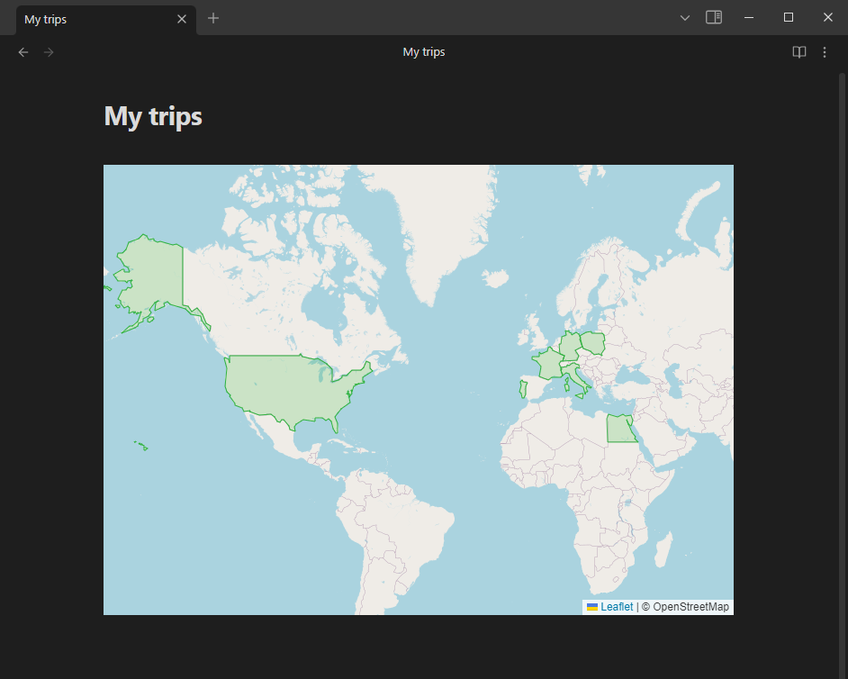

# Obsidian Scratch Map

The Obsidian Scratch Map plugin allows you display a world map embeded in the note with specified countries highlighted.
Perfect for marking visitied countries during your trips.

<p align="center">
  </br></br>
</p>

## Installation

1. Open Obsidian.
2. Go to `Settings` > `Community plugins`.
3. Disable `Safe mode`.
4. Click on `Browse` and search for `Scratch Map`.
5. Click `Install`.
6. Once installed, click `Enable` to activate the plugin.

## Usage

Add a block like the one below in the note.  
To highlight countries simply write their names.  
List of countries can be found here: [countries.geo.json](https://raw.githubusercontent.com/johan/world.geo.json/master/countries.geo.json)  

````
```scratchmap
United States of America
Poland
Germany
France
Portugal
Italy
Egypt
```
````

## Configuration

You can change a highlight color by going to `Settings` > `Scratch Map` > `Highlight Color`. 
